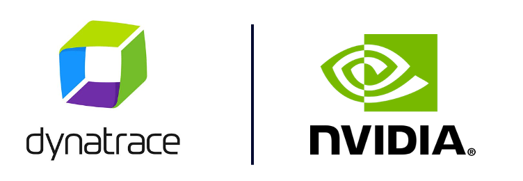

<!-- markdownlint-disable-next-line -->
<!-- Notes to Self
[x] migrate repo
[x] check that works
[x] clean and move app to folder, clean architecture
[x] clean and move images and docs to folder
[x] add RUM 
[x] move docs to gh pages

[ ] add integration tests
[ ] refactor tenant ENV var
[ ] protect branch with git strategy
[ ] version policy

-->

#  NVIDIA Guardrails and Dynatrace Insights

___

  

## 🚀 Demo Overview

This repository is a **demo project** showcasing the **NVIDIA NeMo Agent Toolkit** with **Dynatrace integration**.

  

It is intended for hands-on exploration of how agent-based AI workflows can be built, run, and observed in a practical setup. With this demo, you can:

- run and inspect an agent-based AI implementation using NVIDIA NeMo Agent Toolkit  
- observe behavior, telemetry, and AI monitoring signals with Dynatrace  
- use a structured example that can be adapted for workshops, demos, or technical walkthroughs  

Use this README to understand the demo scope, architecture, and expected outcomes.

## 📚 Documentation

For setup, usage, and implementation details, visit the [GitHub Pages documentation](https://dynatrace-wwse.github.io/demo-nvidia-nemo-agent-toolkit)